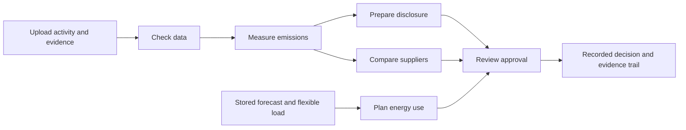

# CarbonMesh User Guide

CarbonMesh turns activity records into emissions measurements, then reuses those
measurements to prepare disclosures and compare purchasing or operating choices.
A person reviews consequential decisions before they are approved. Start with
the measured facts; the assistant is optional, not a prerequisite for using the tool.

The browser reads and writes through the backend. A "Synthetic data" label means
the records are a declared demonstration dataset stored in the database, not
frontend sample values. Empty results and unavailable services are shown explicitly.

## The workflow

You do not have to complete every branch. Supplier comparison, disclosure and
energy planning are separate decisions that share evidence and history.

| Navigation | What belongs here |
| --- | --- |
| Overview | Latest verified measurement, open checks, pending decisions and next actions |
| Upload data | Activity files, supplier catalogs, original evidence documents and emission factors |
| Check data | Import issues and their review decisions |
| Emissions | Calculations, results, breakdowns and visual lineage |
| Disclosures | Evidence-supported claims and unsupported claims that need attention |
| Suppliers | Products, hard purchasing constraints and scenario comparisons |
| Energy planning | Stored forecasts, flexible loads and advisory operating windows |
| Approvals | Exact decision previews, approval or rejection, and stale/expired states |
| Assistant | Optional bounded analysis using selected business records |
| Activity | Saved assistant runs, results, progress and interruptions |
| Evidence trail | Recorded events, supporting documents and linked history |

Company, site and reporting period come from the configured workspace. Choose
records by name and date. There is no reason to copy identifiers between screens.
Internal references still connect database records and deep links.

## Before starting

1. Start the API and frontend as described in the repository README.
2. Open the Overview and confirm the intended site, period and synthetic-data label.
3. Check that the named selectors load. An empty selector means there are no
   matching stored records, not that you should invent an identifier.
4. Use the recorded-user selector on command forms. This attributes the action;
   it is not a login or permission system. Approval decisions need an eligible approver.

The no-login workspace is for trusted local/demo use. Keep its API private.
API failures remain visible and can be retried; they do not produce substitute results.

## Case 1 Measure purchased materials

**Required:** material activity, a compatible emission factor, a configured
measurement method and an active analyst in the selected workspace.

1. Open **Upload data**, then **Activity & suppliers**.
2. Choose the activity import type, give the source a recognizable name and
   upload a CSV or JSON file matching the backend contract.
   The repository includes `data/demo/activity.csv` as a synthetic recycled
   aluminium example. Its supplier/product references must already exist in
   the selected company.
3. Submit the import. Review accepted/rejected counts and the import status.
   The import remains selectable by its name and date.
4. Follow the quality-check action to **Check data**. Review the row, field and
   message for each issue. Correct invalid source data and import the correction
   where required; a review decision does not repair a raw row.
5. Open **Emissions** and start a calculation. Choose **Purchased material / Scope 3**,
   enter the material code from the imported activity and choose the acting user.
   The calculation uses the configured workspace and reporting period. Submit once.
6. Open the returned result. Review its value, unit, status and confidence.
7. Open its breakdown and evidence diagram. Follow the source and factor links
   to inspect what the calculation actually used.

**Expected result:** a backend-calculated measurement linked to activity,
factors, calculations and recorded events. The Overview's latest result is an
individual measurement, not the sum of repeated calculation versions.

**When blocked:** missing factors or invalid activity must be corrected upstream.
Do not treat a missing value as zero or waive a blocking error to force a result.

## Case 2 Measure electricity

**Required:** hourly electricity activity and stored, timestamp-aligned grid
intensity data for the same site and interval.

1. Upload the electricity activity through **Upload data** and review its checks.
2. In **Emissions**, start a calculation and choose the electricity path.
3. Confirm the configured workspace and reporting period, choose the acting user,
   and calculate. Supply a grid zone or method version only when needed to select
   the intended stored grid data.
4. Review the hourly/source breakdown, confidence and evidence diagram.

Electricity Maps controls and live calls are disabled in the normal workspace.
This calculation uses stored data; it does not fetch missing history. If the
required grid intervals are absent, the data owner must supply suitable stored
data through the reviewed backend/operator workflow. Missing intervals are not
interpolated, replaced by fixtures or quietly treated as zero.

## Case 3 Compare suppliers

**Required:** supplier products with evidence, a verified purchased-material
measurement and an applicable scoring method.

1. Open **Suppliers**. Search by supplier/product name and inspect evidence,
   material, unit, carbon factor, price, lead time and circularity information.
2. Start a new scenario. Choose the current product and a matching verified
   purchased-material measurement by their readable names.
3. Enter the quantity and select the scoring method and acting user.
4. Set the actual hard constraints: permitted cost increase, lead time,
   circularity, certification or other available material requirements.
5. Create the scenario. Review feasible and rejected options, rejection reasons,
   criterion scores, projected emissions and commercial trade-offs.
6. Open the recommended option's evidence and approval preview. Continue to
   **Approvals** for the human decision.

**Expected result:** a reproducible comparison with an evidence-supported
recommendation when an option satisfies every hard constraint. Projected avoided
emissions are not already-realized reductions or a completed purchase.

**When no option qualifies:** the result is genuinely infeasible. Review the
commercial inputs or add better supplier data; the system must not relax the
constraints automatically.

## Case 4 Prepare a disclosure

**Required:** a suitable verified measurement, a supported disclosure standard
with requirements, and relevant evidence documents.

1. Open **Upload data > Evidence documents** to upload original supporting files.
   Give each document a useful name and choose its evidence type. Upload/indexing
   may require the configured embedding provider; failures are not replaced with
   fabricated evidence.
2. Open **Disclosures** and choose the standard and relevant requirements.
3. Select the measurement and acting user, enter a draft title and create the
   draft. Supporting evidence is retrieved from the uploaded records by the backend.
4. Select the reviewer and choose **Validate draft**. Review each claim
   individually, including its facts, citations, support status and evidence gaps.
5. Follow the evidence links when a claim is unclear. A document being present
   does not by itself prove that it supports the claim.
6. Follow **Review approval** when a preview is available, then continue to
   **Approvals**. Export an evidence pack when available.

**Expected result:** a draft with traceable claims. This is a POC disclosure
draft, not an assurance opinion or regulatory filing.

**When a claim is unsupported:** supply relevant evidence or revise the claim
through the supported workflow. Unsupported numbers or reduction claims must
remain blocked rather than appearing verified.

## Case 5 Plan energy use

**Required:** an active flexible load, a stored forecast snapshot and a dispatch
method. There is no live forecast fetch in this screen.

1. Open **Energy planning** and inspect the available load's power and duration.
2. Choose the load, stored forecast and method by name. Forecast names include
   their issue date so snapshots can be distinguished.
3. Set the earliest start, latest finish, baseline start and maximum delay.
   Enter capacity and blackout constraints where applicable. Times labeled UTC
   must be entered as UTC, not assumed to be local time.
4. Create the advisory scenario. On its detail screen, confirm that the recorded
   constraints must be kept and choose **Optimize scenario**. Compare the baseline
   and recommended windows, projected emissions, savings and candidate windows.
5. Check feasibility and evidence. Create or review the approval preview and
   continue to **Approvals**.

**Expected result:** a complete feasible operating window when one exists.
Approval records a human decision only: CarbonMesh cannot switch equipment on,
change its schedule or send a control command.

**When blocked:** no stored forecast, missing hourly points, expired/stale facts
or incompatible constraints must be addressed upstream. Selecting a different
snapshot is an explicit decision, not an automatic fallback.

## Case 6 Review an approval

1. Open **Approvals**, or follow the action from a disclosure or scenario.
2. Select the pending item by its business name/type and date.
3. Review the exact facts, evidence, recommendation and trade-offs. Follow the
   linked result or evidence trail before deciding when more context is needed.
4. Confirm that the preview is current and not expired. Select an eligible
   approver and enter the decision note required by the form.
5. Approve or reject. Wait for the recorded result before leaving the screen.
6. Follow the decision's evidence/history link to confirm what was recorded.

A stale or expired preview cannot be approved. Return to the originating
workflow and obtain a fresh preview after correcting its dependencies. Retries
retain the operation's idempotency behaviour; repeated clicks must not create
duplicate decision events. An approval never silently updates the payload being
reviewed.

## Case 7 Use the assistant

The assistant needs a configured model provider and its server-side credentials.
The manual workflows above remain available without a model provider.

1. Open **Assistant**, choose the workflow and describe the business question.
2. Select the existing measurement, draft or scenario and any other required
   named records. Use the available business constraints, not raw identifier lists.
3. Start the analysis. **Activity** shows the stored progress and resulting
   artifacts, facts, recommendations and unsupported items.
4. If clarification is requested, supply the requested selections or constraints
   and resume. If approval is required, review it in **Approvals** first.
5. Return to the run to observe the recorded decision or resume when allowed.
   Select the original requester for a clarification; changing the person does
   not transfer ownership of a saved activity. Follow-up requests use the
   original context where the backend permits it.

Older activities created with the previous source-calculation interface remain
readable, but that legacy clarification form is not available in the simplified
workspace. Complete the needed manual calculation and start an analysis from
the saved result instead; the old activity is not silently rewritten.

Provider unavailable, no data, unsupported, infeasible, stale and budget-exhausted
are real outcomes, not successful results. A fresh workflow that requires live
grid synchronization remains blocked while live calls are disabled. Use suitable
stored artifacts instead; do not interpret disabled provider access as a signal
to substitute demonstration values.

## Case 8 Trace a number or decision

1. Open a measurement or an event in **Evidence trail**.
2. Inspect the directed diagram. Its nodes and arrows come from stored lineage,
   not a generic illustration of how a workflow ought to work.
3. Zoom or fit the diagram, then select a record to view its readable details
   and available source/history links.
4. Follow an original source to inspect or download its content when retained.
5. Review the recorded history to distinguish the original measurement, later
   corrections and approval decisions.

An immediate-neighbour diagram is not necessarily a complete recursive history.
Respect partial-lineage notices and follow linked records for more detail. Some
older source records contain metadata/checksums but no original file bytes. A
download failure for those records is a data-retention gap; the original file
must be supplied rather than reconstructed from a checksum.

## Common outcomes

| What you see | What to do |
| --- | --- |
| Loading | Let that section finish; other sections can load independently |
| No matching records | Check the selected workspace/search or add the required upstream data |
| Data unavailable | Check backend/database connectivity, then retry; do not assume zero |
| Validation failed | Correct the named fields or underlying source data |
| Unsupported claim | Add relevant support or revise the draft; do not approve as verified |
| No feasible option | Review actual constraints and source options without silently weakening rules |
| Stale or expired | Return to the originating workflow and create a fresh preview |
| Provider unavailable | Have the data/model owner check server configuration; stored reads remain separate |
| Live integration disabled | Expected for this workspace; use stored data or an explicitly reviewed operator process |

## Suggested demonstration order

Use **Overview -> Upload data -> Check data -> Emissions -> Suppliers -> Approvals
-> Evidence trail** for the shortest material-based demonstration. Add the
disclosure and energy-planning branches only when their required measurements,
evidence and stored forecasts exist. Use **Assistant -> Activity** last to show
the same domain workflows with bounded orchestration.

Never reset the shared database merely to make a screen look populated. Reset
and provider configuration are operator activities outside the normal interface.
